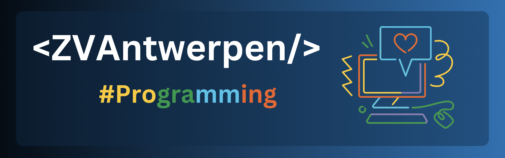

  
##  Hey, I'm Zandré van Antwerpen

**BSc IT Student @ North-West University** |  Software Development & Security Enthusiast |  Always Learning

---

###  About Me

I'm a second-year IT student passionate about understanding how software works under the hood. From systems programming to cybersecurity challenges, I'm exploring different domains to find where I can make the biggest impact.

-  Getting into **CTF competitions** and security challenges
-  Comfortable working in **Linux environments**
-  Experimenting with **Blender** in my free time
-  Always curious, always coding

---

###  Skills

**Languages**  

**Web & Data**  

**Tools & Platforms**  

---

###  Currently Working On

-  Completing my 2nd Year at Uni
-  Participating in **CTF challenges** to sharpen problem-solving and security skills
-  Deepening my knowledge of **C++** and starting **Java** development

---

###  Things I want to Look into in the Future

-  Learning **Blender** for 3D modeling and visualization

### 📂 Featured Projects

<b>High School Portfolio</b>

These projects represent my journey into programming during high school:

- **[Monster Math](https://github.com/ZVAntwerpen/Monster_Math)** — Grade 10 educational game for primary school math practice
- **[Retail App](https://github.com/ZVAntwerpen/Retail_App)** — Grade 11 business management system for inventory tracking
- **[Properties](https://github.com/ZVAntwerpen/Properties_App)** — Grade 12 real estate management application *(coming soon)*

<b>University & Personal Work</b>

> 🔨 **Building in progress** — Check back soon for coursework projects and personal experiments!

---

### 💬 Let's Connect

I'm always open to collaborating on projects, discussing tech, or just connecting with fellow developers. Feel free to reach out!

📧 **Email:** [zandreva12@gmail.com](mailto:zandreva12@gmail.com)  

---

  
*"The best way to predict the future is to invent it."* — Alan Kay

